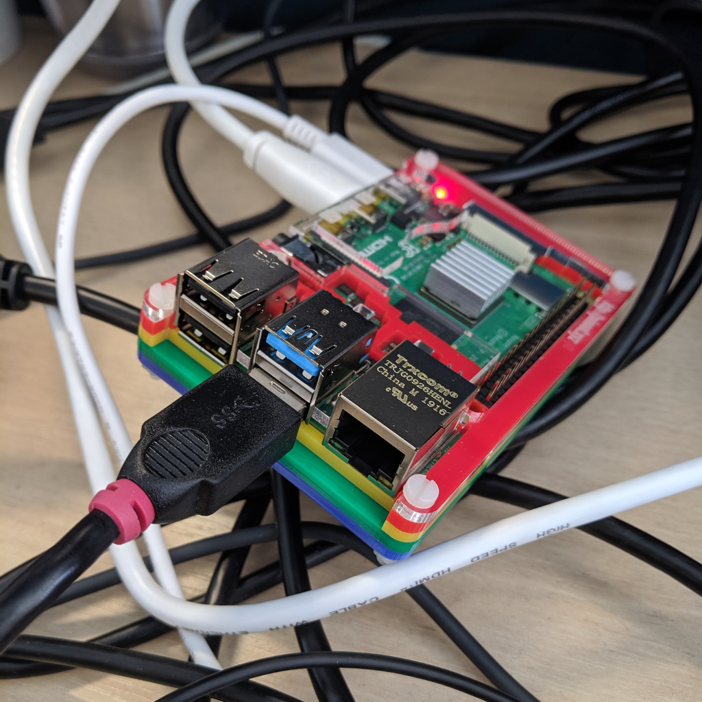
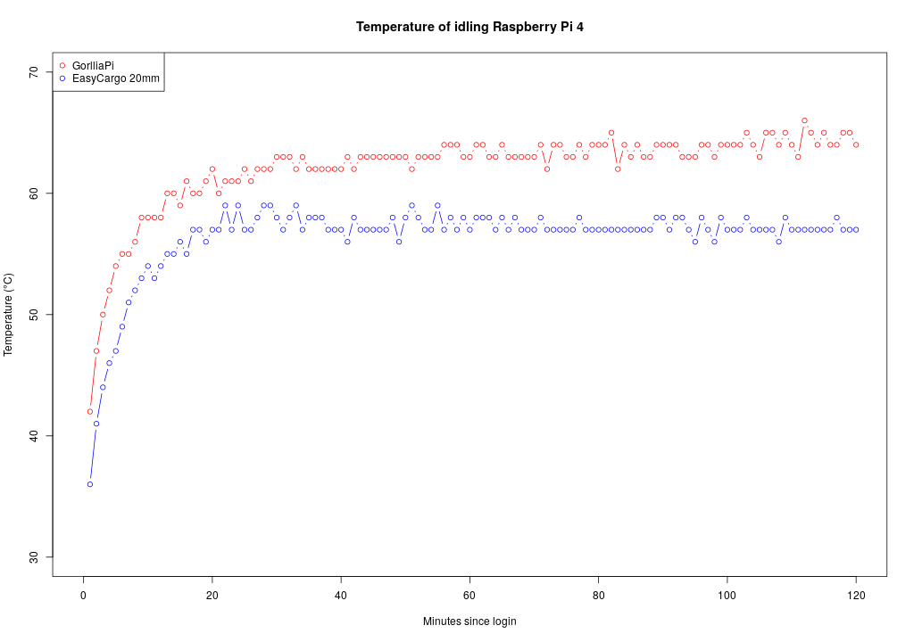

# Plot of temperature of my Pi 4.

This is my Raspberry Pi 4 idling at desktop in my air conditioned office, in a Pimoroni Coupe case with a GorrilaPi heatsink.

This is a plot of the temperatures since login which are obviously less than ideal.

